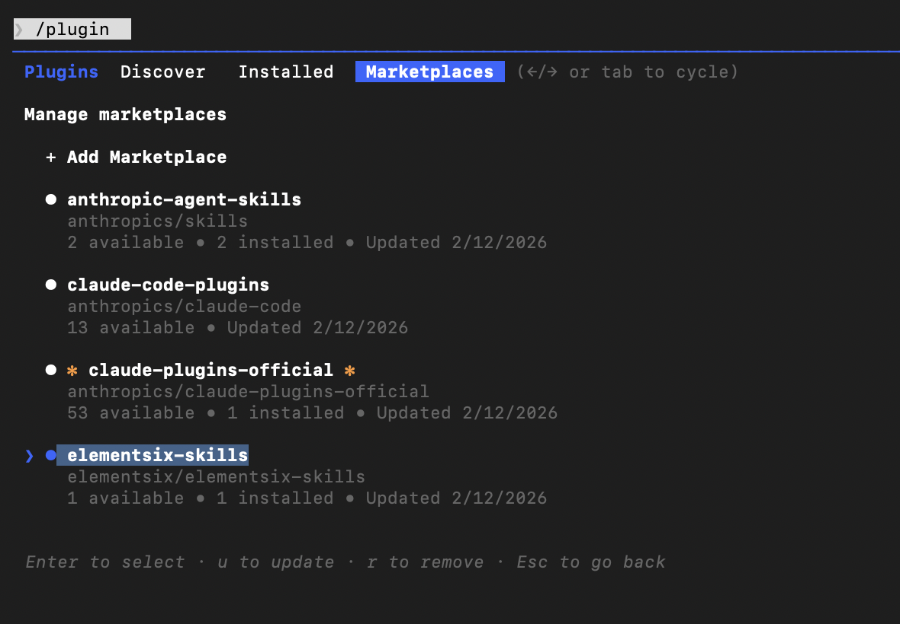

# 🎬 Seedance Storyboard

<p align="center">
  <a href="README_CN.md">中文</a> | <a href="README.md">English</a>
</p>

<p align="center">
  
  &nbsp;
  
  &nbsp;
  <a href="LICENSE"></a>
</p>

A Claude Code Skill that transforms any idea into professional Seedance 2.0 video storyboard prompts.

## 📖 Introduction

Seedance 2.0 is a powerful multimodal AI video generation model by Jimeng (CapCut), but writing good prompts is difficult for most people. This Skill guides you step-by-step to transform simple ideas into professional storyboard prompts.

## ✨ Features

- ✅ **Step-by-Step Guidance** - Complete workflow from idea to prompt
- ✅ **Full Capability Coverage** - Supports all Seedance 2.0 features (multimodal, extension, editing, etc.)
- ✅ **Professional Templates** - 6 storyboard templates and 10 complete examples
- ✅ **Chinese Optimized** - Designed specifically for Chinese users

## 🚀 Installation

### Prerequisites

- [Claude Code](https://claude.ai/code) installed

### Installation Steps

```bash
# 1. Add Marketplace
/plugin marketplace add elementsix/elementsix-skills

# 2. Install Skill
/plugin install seedance-storyboard@elementsix-skills

# 3. Restart Claude Code (Important!)
# Exit Claude Code and re-enter for the /seedance-storyboard command to work
```

> ⚠️ **Note**: You **must exit and re-enter Claude Code** after installation for the `/seedance-storyboard` command to become available.

## 🔄 Update Skill

To update the skill to the latest version:

1. Run `/plugin` in Claude Code
2. Switch to the **Marketplaces** tab (use arrow keys or Tab)
3. Select `elementsix-skills`
4. Select `Update marketplace`

You can also select `Enable auto-update` to automatically get the latest version on each startup.



## 🎯 Usage

After installation, use the following command:

```bash
/seedance-storyboard
```

Claude will then guide you through:

1. **Understanding your idea** - What story do you want to tell?
2. **Deep dive** - Style, camera work, motion, sound
3. **Storyboard construction** - Break down shots by timeline
4. **Prompt generation** - Output professional, ready-to-use prompts
5. **Optimization suggestions** - Improvement tips and multimodal asset recommendations

## 💡 Examples

### Example 1: Traditional Dance

**Your idea**: "A girl dancing under cherry blossom trees"

**Generated Prompt**:
```
Cinematic realistic style, 15 seconds, 16:9 widescreen, warm sunset golden hour atmosphere

0-3s: Wide shot slowly pushing in, horizon sunset, girl silhouette standing on beach, dress flowing in sea breeze
3-7s: Medium shot orbiting camera, girl begins spinning and dancing, long hair and dress flying, sunset backlight creating rim light
7-11s: Close-up tracking shot, girl dancing facing camera, expression free and joyful, waves gently hitting beach as background
11-13s: Close-up hand movement, fingers tracing the sunset, light and shadow flowing at fingertips
13-15s: Wide shot pulling back, girl freezes in afterglow, fade to black

Background audio: Ocean waves + gentle piano music
```

### Example 2: Product Advertisement

**Your idea**: "Showcase a new smartphone"

**More examples** in `seedance-storyboard/examples/example-prompts.md`

## 📁 File Structure

```
elementsix-skills/
├── .claude-plugin/
│   └── marketplace.json              # Marketplace configuration
├── README.md                         # This file (Chinese)
├── README_CN.md                      # Chinese version
└── skills/
    └── seedance-storyboard/          # Main Skill directory
        ├── SKILL.md                  # Skill core logic
        ├── README.md                 # Skill detailed documentation
        ├── quick-reference.md        # Quick reference card
        ├── templates/
        │   └── storyboard-template.md    # 6 storyboard templates
        └── examples/
            └── example-prompts.md        # 10 complete examples
```

## 🎬 Seedance 2.0 Core Capabilities

- **Multimodal Input**: Images (≤9), Videos (≤3), Audio (≤3), Text
- **Reference Images**: Precise reproduction of composition, character details
- **Reference Videos**: Support for camera language, complex motion rhythm, creative effects replication
- **Video Extension**: Smooth extension and connection, can "continue filming"
- **Video Editing**: Character replacement, plot subversion, clip adjustment

## 📝 Prompt Syntax

Use `@asset-name` to reference multimodal assets:

```
@image1 as first frame
@image2 as character reference
@video1 reference camera movement
@audio1 for background music
```

## 🔗 Jimeng Platform Info

- **Website**: https://jimeng.jianying.com
- **Entry**: Seedance 2.0 - Universal Reference / First-Last Frame
- **Limitation**: Realistic human face materials not currently supported

## 🤝 Contributing

Issues and PRs welcome!

## 📄 License

MIT License

---

## ⭐ Star History

<p align="center">
  <a href="https://star-history.com/#elementsix/elementsix-skills&Date">
    
  </a>
</p>
